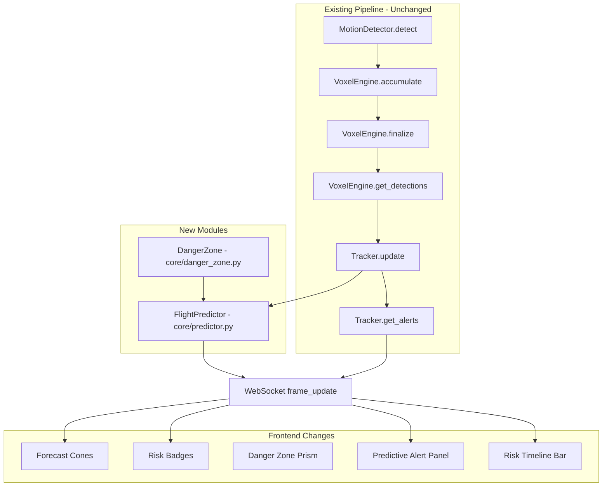

# Predictive Flight Path Forecasting and Collision Risk Scoring

## Feasibility Analysis

### Dependencies

All required libraries (`numpy`, `scipy`, `numba`) are already in `[requirements.txt](requirements.txt)`. No new dependencies needed.

### Computational Cost

- Kalman filter per track: 9x9 state matrix operations (~30 tracks max) -- negligible compared to the Numba JIT voxel engine that already runs every frame.
- Forecast propagation: 60 steps x 30 tracks = 1800 lightweight matrix multiplies per frame. Estimated <1ms total.
- Gaussian-box overlap via `scipy.stats.norm.cdf`: 6 CDF evaluations x 60 timesteps x 30 tracks = ~10,800 calls. Each call is ~1 microsecond. Total <15ms. Acceptable within the 100ms frame budget.

### Data Availability

The existing `Track` dataclass already stores `positions`, `timestamps`, and `velocities` -- the exact inputs a Kalman filter needs. The `predicted_position()` method on line 43 of `[core/tracker.py](core/tracker.py)` already does linear prediction; the Kalman filter is a strict upgrade.

### WebSocket Bandwidth

Adding `forecast` (60 x 3 floats = 180 numbers), `risk_score` (1 float), and `risk_level` (1 string) per track. For 30 tracks, this adds ~22KB per frame_update message. Current messages already include trajectories, voxels, thumbnails, etc. -- this is a modest increase.

### Verdict: Fully feasible. No blockers.

---

## Architecture Overview




---

## Phase 1: Core Modules

### 1A. New file: `core/danger_zone.py`

Encapsulates the runway danger volume geometry, kept separate from the predictor for single-responsibility and future reuse (e.g., automated deterrents).

**Key class: `DangerZone**`

```python
@dataclass
class DangerZone:
    runway_center: Tuple[float, float, float] = (0.0, 200.0, 0.0)
    runway_half_width: float = 300.0
    runway_half_length: float = 400.0
    altitude_min: float = 10.0
    altitude_max: float = 150.0
```

**Methods:**

- `contains(point: np.ndarray) -> bool` -- axis-aligned box test against the rectangular prism defined by `(center_x +/- half_width, center_y +/- half_length, alt_min to alt_max)`.
- `overlap_probability(mean: np.ndarray, covariance: np.ndarray) -> float` -- compute the probability that a Gaussian distribution with given mean/covariance overlaps the box. Uses product of independent `scipy.stats.norm.cdf` evaluations on each axis: `P = product_i(CDF(upper_i) - CDF(lower_i))` where bounds come from the box edges and `mean_i, sqrt(cov[i,i])` come from the state.
- `time_to_entry(position: np.ndarray, velocity: np.ndarray) -> float` -- linear estimate: minimum time for the point traveling at constant velocity to cross any face of the box. Returns `float('inf')` if heading away.
- `get_bounds() -> dict` -- returns box min/max corners for frontend rendering.

**Design choice: Axis-aligned box vs oriented bounding box**


| Approach                    | Pros                                     | Cons                                            |
| --------------------------- | ---------------------------------------- | ----------------------------------------------- |
| Axis-aligned box (AABB)     | Simple CDF math, fast, easy to visualize | Runway must align with axes                     |
| Oriented bounding box (OBB) | Supports rotated runways                 | Requires rotating the Gaussian into local frame |


**Decision:** Use AABB for v1. The existing runway in the 3D scene is axis-aligned (centered at y=200, along the Y axis). The config already uses `alert_runway_distance` as a single radius. We parameterize as `half_width` and `half_length` so a future rotation transform is easy to add.

**Tradeoff note:** If a future deployment has a rotated runway, we would need to transform the Gaussian mean/covariance into the runway-local frame before applying CDF. This is a straightforward matrix rotation and does not change the algorithm.

### 1B. New file: `core/predictor.py`

**Key class: `FlightPredictor**`

```python
@dataclass
class KalmanState:
    x: np.ndarray       # 9-element state [px, py, pz, vx, vy, vz, ax, ay, az]
    P: np.ndarray       # 9x9 covariance matrix
    last_update: float   # timestamp of last measurement

class FlightPredictor:
    def __init__(self, config: PredictionConfig, danger_zone: DangerZone): ...
    def update(self, tracks: List[Track]) -> List[dict]: ...
```

**Kalman Filter Design:**

State vector (9D): `[x, y, z, vx, vy, vz, ax, ay, az]`

- **F matrix** (state transition): standard constant-acceleration kinematic model, parameterized by `dt`.
- **H matrix** (observation): 3x9, selects position `[x, y, z]` from state.
- **Q matrix** (process noise): Block diagonal. Position noise is small; velocity noise moderate; acceleration noise tuned to bird maneuverability (~2-5 m/s^2 lateral, ~3 m/s^2 vertical). Uses adaptive scaling: when the innovation residual exceeds 2-sigma, Q is inflated by a factor (e.g., 3x) to accommodate maneuvering.
- **R matrix** (measurement noise): Diagonal, derived from voxel resolution (~3m voxel size -> sigma ~1.5m per axis).

**Alternative filter designs considered:**


| Approach                               | Pros                                    | Cons                                                 |
| -------------------------------------- | --------------------------------------- | ---------------------------------------------------- |
| Constant-velocity Kalman (6-state)     | Simpler, fewer parameters               | Cannot model turns/climbs; poor prediction beyond 5s |
| Constant-acceleration Kalman (9-state) | Captures maneuvers; good 10-30s horizon | Slightly more complex; acceleration can drift        |
| IMM (Interacting Multiple Model)       | Best accuracy for mode switching        | Significantly more complex; premature for v1         |
| Extended Kalman (EKF)                  | Handles nonlinear dynamics              | Unnecessary for linear kinematic model               |
| Particle filter                        | Handles multimodal distributions        | Far too expensive for real-time with 30 tracks       |


**Decision:** Constant-acceleration (9-state) Kalman filter. It is the simplest model that provides meaningful predictions in the 10-30 second horizon. The adaptive process noise handles the maneuvering case without the complexity of IMM. This is a well-established approach in bird radar systems.

**Tradeoff:** The 9-state model may produce slightly noisier acceleration estimates than a 6-state model in straight-line flight. Mitigated by using moderate acceleration process noise that lets acceleration decay toward zero when residuals are small.

**Trajectory Forecast:**

- Propagate the Kalman state forward in `forecast_step` (default 0.5s) increments for `forecast_horizon` (default 30s) = 60 forecast points.
- At each step, record `(mean_position, covariance_3x3)` -- the position portion of the propagated covariance.
- No measurement update during forecast (pure prediction).

**Risk Score Computation:**

- For each of the 60 forecast points, call `DangerZone.overlap_probability(mean, cov)`.
- Track risk score = `max(overlap_probability)` across all forecast timesteps.
- Risk level thresholds: `< 0.2` = "LOW", `0.2 - 0.6` = "MEDIUM", `> 0.6` = "HIGH".
- Also record `time_to_incursion`: the forecast timestep index where overlap first exceeds a threshold (e.g., 0.3), multiplied by `forecast_step`.

`**FlightPredictor.update(tracks)` method flow:**

1. For each track in `tracks`:
  a. If track has no `kalman_state`, initialize from track's last 2 positions (velocity) or just position.
   b. **Predict** step: advance state by `dt` since last update.
   c. **Update** step: incorporate `track.last_position` as measurement.
   d. Store updated `KalmanState` back on `track.kalman_state`.
   e. **Forecast**: propagate 60 steps forward, collect `(mean, cov)` at each step.
   f. **Score**: compute risk via `DangerZone.overlap_probability` at each forecast step. Take max.
2. Return enriched data for each track: `forecast`, `risk_score`, `risk_level`, `time_to_incursion`.

**Cleanup:** Remove stale Kalman states for tracks no longer in the active set (keyed by `track_id`).

### 1C. Modify: `[config.py](config.py)`

Add a new `PredictionConfig` dataclass after `DetectionConfig` (line 47):

```python
@dataclass
class PredictionConfig:
    forecast_horizon: float = 30.0          # seconds
    forecast_step: float = 0.5              # seconds between forecast points
    process_noise_accel: float = 3.0        # m/s^2, bird maneuverability
    measurement_noise_pos: float = 1.5      # meters, from voxel resolution
    adaptive_noise_factor: float = 3.0      # Q multiplier during maneuvers
    risk_threshold_low: float = 0.2
    risk_threshold_high: float = 0.6
    alert_cooldown: float = 5.0             # seconds between predictive alerts for same track
    runway_half_width: float = 300.0        # meters (aligned with existing alert_runway_distance)
    runway_half_length: float = 400.0       # meters
    enabled: bool = True
```

Add `prediction: PredictionConfig` field to `AppConfig` (line 58):

```python
prediction: PredictionConfig = field(default_factory=PredictionConfig)
```

### 1D. Modify: `[core/tracker.py](core/tracker.py)`

Minimal, non-breaking changes to the `Track` dataclass:

Add three new fields (after line 17):

```python
kalman_state: Optional[object] = None       # populated by predictor
forecast: Optional[List[List[float]]] = None  # predicted positions
risk_score: float = 0.0
risk_level: str = "LOW"
time_to_incursion: Optional[float] = None
```

Extend `to_dict()` (after line 57) to include:

```python
"forecast": self.forecast or [],
"risk_score": round(self.risk_score, 3),
"risk_level": self.risk_level,
"time_to_incursion": round(self.time_to_incursion, 1) if self.time_to_incursion is not None else None,
```

**Why modify `Track` directly rather than a wrapper?**


| Approach                        | Pros                                                       | Cons                                                                   |
| ------------------------------- | ---------------------------------------------------------- | ---------------------------------------------------------------------- |
| Add fields to `Track`           | Simple; `to_dict()` naturally includes them; no API change | Slightly couples predictor output to tracker                           |
| Wrapper `PredictedTrack(Track)` | Clean separation                                           | Dashboard must handle two types; `to_dict()` needs override; more code |
| Separate dict alongside track   | No Track changes                                           | Dashboard must merge two data streams; error-prone                     |


**Decision:** Add fields to `Track`. The fields default to `None`/`0.0`/"LOW", so existing code that doesn't use prediction is completely unaffected. `to_dict()` includes them, which means the WebSocket message gets them automatically through the existing `[t.to_dict() for t in active_tracks]` on line 412 of `[dashboard/app.py](dashboard/app.py)`.

**Tradeoff:** This creates a soft dependency where Track "knows about" prediction fields. Acceptable for a single-codebase project; if this were a library, a wrapper would be better.

---

## Phase 2: Backend Integration

### 2A. Modify: `[dashboard/app.py](dashboard/app.py)`

**Import and instantiate predictor (near line 7):**

```python
from core.predictor import FlightPredictor
from core.danger_zone import DangerZone
```

**In `init_engine()` (around line 49), create predictor:**

```python
danger_zone = DangerZone(
    runway_center=(0, 200, 0),
    runway_half_width=config.prediction.runway_half_width,
    runway_half_length=config.prediction.runway_half_length,
    altitude_min=config.detection.alert_altitude_min,
    altitude_max=config.detection.alert_altitude_max,
)
state["predictor"] = FlightPredictor(config.prediction, danger_zone)
state["danger_zone"] = danger_zone
```

**In `process_frames()`, after line 387 (`active_tracks = tracker.update(detections)`):**

```python
if state["config"].prediction.enabled:
    prediction_data = state["predictor"].update(active_tracks)
```

This single call updates all `track.kalman_state`, `track.forecast`, `track.risk_score`, `track.risk_level`, and `track.time_to_incursion` fields in-place. Since `to_dict()` already serializes them, the existing `"tracks": [t.to_dict() for t in active_tracks]` on line 412 automatically includes prediction data.

**Generate predictive alerts (after line 388):**

```python
predictive_alerts = []
if state["config"].prediction.enabled:
    for track in active_tracks:
        if track.risk_score > state["config"].prediction.risk_threshold_high:
            tti = track.time_to_incursion
            predictive_alerts.append({
                "track_id": track.track_id,
                "severity": "PREDICTIVE",
                "message": f"Bird #{track.track_id} predicted incursion in {tti:.0f}s "
                           f"(risk: {track.risk_score:.0%})",
                "position": track.last_position.tolist(),
                "speed": track.speed,
                "risk_score": track.risk_score,
                "time_to_incursion": tti,
            })
```

**Include in the frame_update message (modify the `update` dict around line 408):**
Add these fields:

```python
"predictive_alerts": predictive_alerts,
"danger_zone_bounds": state["danger_zone"].get_bounds(),
"aggregate_risk": max((t.risk_score for t in active_tracks), default=0.0),
```

**Add REST endpoint `GET /api/risk-summary` (new route):**

```python
@app.get("/api/risk-summary")
async def risk_summary():
    tracker = state["tracker"]
    active = tracker._active_tracks()
    track_risks = [{"track_id": t.track_id, "risk_score": t.risk_score,
                     "risk_level": t.risk_level} for t in active]
    return {
        "aggregate_risk": max((t.risk_score for t in active), default=0.0),
        "track_risks": track_risks,
        "danger_zone": state.get("danger_zone", DangerZone()).get_bounds(),
    }
```

**Reset predictor when tracker resets:**
In all places where `tracker.reset()` is called (lines 193, 229, 255, 280), also call:

```python
if "predictor" in state:
    state["predictor"].reset()
```

---

## Phase 3: Frontend Visualization

### 3A. Danger Zone Prism

Currently only a 2D alert ring exists (line 829-834 of `[index.html](dashboard/templates/index.html)`). Add a semi-transparent 3D box:

```javascript
let dangerZoneMesh = null;
function renderDangerZone(bounds) {
    if (dangerZoneMesh) { scene.remove(dangerZoneMesh); }
    const size = [bounds.max[0]-bounds.min[0], bounds.max[1]-bounds.min[1], bounds.max[2]-bounds.min[2]];
    const center = [(bounds.max[0]+bounds.min[0])/2, (bounds.max[1]+bounds.min[1])/2, (bounds.max[2]+bounds.min[2])/2];
    const geo = new THREE.BoxGeometry(size[0], size[1], size[2]);
    const mat = new THREE.MeshBasicMaterial({
        color: 0xff4757, transparent: true, opacity: 0.06,
        side: THREE.DoubleSide, depthWrite: false
    });
    dangerZoneMesh = new THREE.Mesh(geo, mat);
    dangerZoneMesh.position.set(center[0], center[1], center[2]);
    const edges = new THREE.EdgesGeometry(geo);
    const lineMat = new THREE.LineBasicMaterial({ color: 0xff4757, transparent: true, opacity: 0.3 });
    dangerZoneMesh.add(new THREE.LineSegments(edges, lineMat));
    scene.add(dangerZoneMesh);
}
```

Rendered once from the first `frame_update` that contains `danger_zone_bounds`.

### 3B. Forecast Trajectory Cones

For each active track with a non-empty `forecast`, draw a tapered tube (using `TubeGeometry` on a `CatmullRomCurve3`) from the current position along the forecast path. The tube radius expands along its length (simulating the growing uncertainty cone). Color-coded by `risk_level`:

- LOW: cyan (`0x00c8ff`)
- MEDIUM: orange (`0xffa502`)
- HIGH: red (`0xff4757`)

```javascript
const forecastMeshes = {};
function updateForecastCones(tracks) {
    // Remove old cones
    Object.keys(forecastMeshes).forEach(id => {
        scene.remove(forecastMeshes[id]);
        forecastMeshes[id].geometry.dispose();
        delete forecastMeshes[id];
    });
    for (const t of tracks) {
        if (!t.forecast || t.forecast.length < 2) continue;
        const points = t.forecast.map(p => new THREE.Vector3(p[0], p[1], p[2]));
        const curve = new THREE.CatmullRomCurve3(points);
        const radii = points.map((_, i) => 1 + (i / points.length) * 8); // expanding
        const color = t.risk_level === 'HIGH' ? 0xff4757 :
                      t.risk_level === 'MEDIUM' ? 0xffa502 : 0x00c8ff;
        const geo = new THREE.TubeGeometry(curve, points.length, 2, 6, false);
        const mat = new THREE.MeshBasicMaterial({
            color, transparent: true, opacity: 0.15, depthWrite: false
        });
        const mesh = new THREE.Mesh(geo, mat);
        scene.add(mesh);
        forecastMeshes[t.id] = mesh;
    }
}
```

**Alternative: Line with variable width vs TubeGeometry**


| Approach                          | Pros                                      | Cons                                                                         |
| --------------------------------- | ----------------------------------------- | ---------------------------------------------------------------------------- |
| `TubeGeometry`                    | True 3D cone; looks great from all angles | More vertices; slightly heavier                                              |
| `Line2` with varying width        | Lighter; simpler                          | Requires `LineGeometry` from examples; width is screen-space not world-space |
| Simple `Line` with dashed pattern | Lightest                                  | No cone effect; less informative                                             |


**Decision:** `TubeGeometry` with low segment counts (`tubularSegments=30, radialSegments=6`). For 30 tracks this is ~5400 vertices total, trivial for any GPU. The visual payoff of a proper expanding cone is worth it.

### 3C. Risk Score Badge in Track List

Modify the `#tracksList` rendering (line 999-1011 of `[index.html](dashboard/templates/index.html)`) to add a risk badge:

```javascript
const riskColor = t.risk_level === 'HIGH' ? 'var(--danger)' :
                  t.risk_level === 'MEDIUM' ? 'var(--warning)' : 'var(--accent)';
const ttiText = t.time_to_incursion != null ? `${t.time_to_incursion.toFixed(0)}s` : '--';
```

Add to each track-item div:

```html
<div class="track-risk" style="color:${riskColor};font-size:10px;text-align:right;">
  <div style="font-weight:600;">${(t.risk_score * 100).toFixed(0)}%</div>
  <div>TTI: ${ttiText}</div>
</div>
```

### 3D. Predictive Alert Panel

In the alerts rendering (line 980-994), merge `predictive_alerts` before `alerts`. Predictive alerts get a distinct styling with a purple/orange icon and show time-to-incursion:

```javascript
const allAlerts = [...(msg.predictive_alerts || []), ...alerts];
```

For predictive alerts, render with a different template:

```html
<div class="alert-item predictive">
  <span class="alert-icon">&#9201;</span>  <!-- timer icon -->
  <div class="alert-text">
    <strong>PREDICTIVE</strong>
    ${a.message}
  </div>
</div>
```

Add CSS for `.alert-item.predictive` with an orange-yellow gradient border-left.

### 3E. Risk Timeline Bar

Add a thin (4px) colored bar directly above the existing timeline (line 510):

```html
<div class="risk-timeline" id="riskTimeline" style="height:4px;width:100%;background:var(--bg-secondary);border-radius:2px;overflow:hidden;margin-bottom:2px;">
  <div id="riskTimelineSegments" style="display:flex;height:100%;"></div>
</div>
```

On each `frame_update`, append a colored segment proportional to 1/total_frames width. Color derived from `aggregate_risk`:

- green (0x00e88a) for < 0.2
- yellow (0xffd43b) for 0.2-0.6
- red (0xff4757) for > 0.6

This builds up over time as frames process, giving a visual history of risk.

### 3F. Additional CSS

Add styles for:

- `.alert-item.predictive` -- distinct border-left color (orange)
- `.track-risk` -- right-aligned risk display in track items
- `.risk-timeline` -- thin bar above the playback timeline

---

## Phase 4: Unit Tests

### New file: `tests/test_predictor.py`

Since there are no existing tests in the repo, we need to also create `tests/__init__.py`.

**Test cases:**

1. `**test_kalman_converges_constant_velocity**` -- Create a synthetic track moving at constant 10 m/s in +Y direction. Feed 10 positions. After 5 frames, the Kalman velocity estimate should be within 10% of true velocity.
2. `**test_forecast_straight_line_toward_runway**` -- Track at position `(0, 0, 50)` heading toward runway at `(0, 200, 50)` at 10 m/s. Forecast should show risk > 0.6 within 20s (200m / 10 m/s).
3. `**test_forecast_heading_away**` -- Track at `(0, 400, 50)` heading away from runway at 10 m/s. Risk should be < 0.1.
4. `**test_covariance_grows_with_horizon**` -- Verify that the position covariance at forecast step N+1 is >= covariance at step N (monotonically non-decreasing trace).
5. `**test_risk_score_zero_no_tracks**` -- Empty track list returns empty prediction data.
6. `**test_danger_zone_contains**` -- Points inside/outside the box return correct booleans.
7. `**test_danger_zone_overlap_probability**` -- Known Gaussian fully inside box has overlap ~1.0; fully outside has overlap ~0.0.
8. `**test_time_to_entry**` -- Linear estimate matches expected time for a point heading straight toward the box face.
9. `**test_predictor_cleanup_stale_states**` -- After a track goes inactive, its Kalman state is removed from the predictor's internal dict.
10. `**test_adaptive_noise_increases_during_maneuver**` -- Feed a track that makes a sharp turn; verify the effective Q increases.

---

## File Change Summary


| File                             | Change                                                                                                | Lines Added (est.) |
| -------------------------------- | ----------------------------------------------------------------------------------------------------- | ------------------ |
| `core/predictor.py`              | **New**                                                                                               | ~200               |
| `core/danger_zone.py`            | **New**                                                                                               | ~80                |
| `core/tracker.py`                | Modify: add 5 fields to Track, extend to_dict                                                         | ~15                |
| `config.py`                      | Modify: add PredictionConfig, add field to AppConfig                                                  | ~15                |
| `dashboard/app.py`               | Modify: import/instantiate predictor, call in loop, predictive alerts, new REST endpoint, reset hooks | ~50                |
| `dashboard/templates/index.html` | Modify: forecast cones, risk badges, danger zone prism, predictive alerts, risk timeline, CSS         | ~150               |
| `tests/__init__.py`              | **New**                                                                                               | 1                  |
| `tests/test_predictor.py`        | **New**                                                                                               | ~180               |


**Total estimated new/changed lines: ~690**

---

## Risk Mitigations

1. **Zero regression guarantee**: The predictor is called *after* `tracker.update()` and `tracker.get_alerts()`. It only *writes* to new fields (`kalman_state`, `forecast`, `risk_score`, `risk_level`). Existing reactive alerts continue to fire from `get_alerts()` unchanged.
2. **Graceful degradation**: If `prediction.enabled` is `False`, no predictor runs and all new fields stay at their defaults (`forecast=None`, `risk_score=0.0`, `risk_level="LOW"`). Frontend renders them as empty/zero.
3. **Performance safety**: If Kalman update ever takes too long (unlikely), the `enabled` flag provides an instant kill switch.
4. **Alert fatigue**: The `alert_cooldown` config (default 5s) prevents the same track from generating repeated predictive alerts. Implemented via a `last_alert_time` dict in `FlightPredictor`, keyed by `track_id`.
5. **NaN/Inf protection**: Add guards in the Kalman update for degenerate covariance (e.g., if P becomes non-positive-definite, reinitialize from scratch). Use `np.isfinite()` checks on the risk score.

